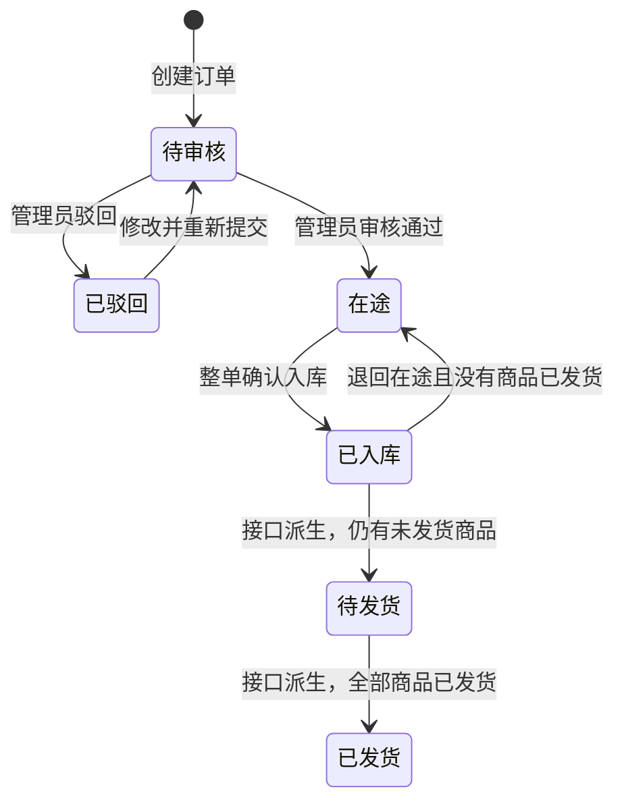
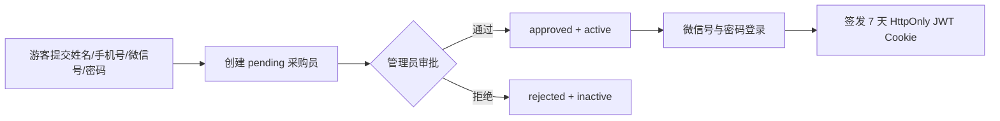
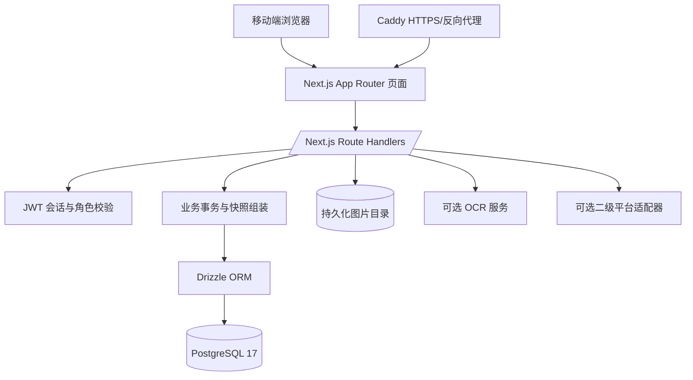
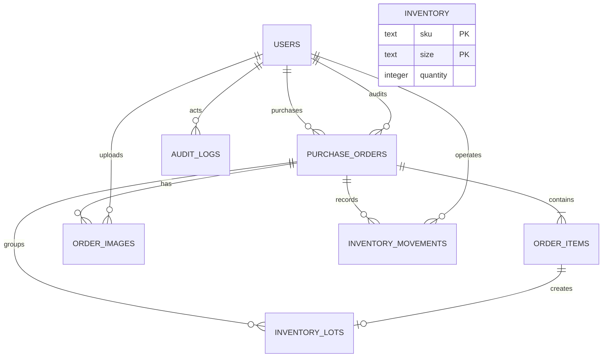
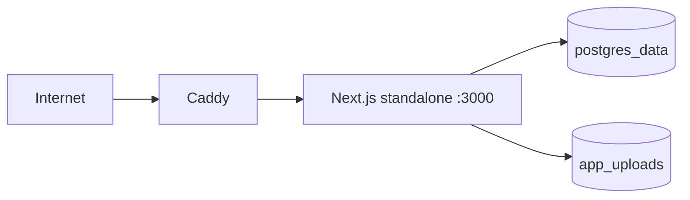

# 骏骏订单管理系统知识库

> 最后核对：2026-09-15。本文以当前仓库代码为准，用于产品理解、开发维护、故障排查和后续交接。若文档与运行行为不一致，应先以数据库迁移和服务端代码为准，再同步修正文档。表结构快照见 [数据库设计](数据库设计.md)。

## 1. 系统定位

骏骏订单是一套面向小团队的移动端采购转卖管理系统，贯穿以下业务链路：

1. 采购员或管理员录入采购订单及商品明细（分步操作见 [上传订单教程](%E4%B8%8A%E4%BC%A0%E8%AE%A2%E5%8D%95%E6%95%99%E7%A8%8B.html)）。
2. 管理员审核订单，驳回错误订单或允许其进入在途状态。
3. 包裹到达后，管理员按整单确认入库，系统同步增加库存。
4. 商品售出后，管理员按商品行记录二级平台、售价和发货物流，系统同步扣减库存。
5. 管理员查看订单、库存、采购与销售概览，可导出完整 CSV，也可把订单列表当前筛选结果或勾选订单导出为 Excel，或用「导出文案」复制成按货号、商品名、尺码合并件数的采购清单文本（`lib/order-copy.ts`，纯前端生成）。
6. 订单、库存和多数账号管理写操作写入审计日志，以便追踪操作人和业务对象。

系统采用自托管模式：前端、后端 API、PostgreSQL、图片文件和反向代理均由本仓库提供，不依赖 ChatGPT、Cloudflare D1/R2 等外部运行时。

## 2. 业务角色与权限

| 能力 | 游客 | 采购员 `buyer` | 管理员 `admin` |
| --- | --- | --- | --- |
| 申请采购员账号 | 是 | 无需 | 无需 |
| 登录 | 否 | 仅审批通过且启用后 | 账号启用后 |
| 创建采购订单 | 否 | 是 | 是 |
| 查看订单 | 否 | 仅本人订单 | 全部订单 |
| 修改驳回订单并重提 | 否 | 仅本人订单 | 是 |
| 编辑任意订单 | 否 | 否 | 是 |
| 审核、入库、退回在途 | 否 | 否 | 是 |
| 单商品/批量发货 | 否 | 否 | 是 |
| 查看库存、采购员联系方式 | 否 | 否 | 是 |
| 删除订单、导出 CSV / Excel / 文案 | 否 | 否 | 是 |
| 成员管理和账号审批 | 否 | 否 | 是 |

采购员响应还会进行字段裁剪：即使商品已经发货，采购员看到的订单状态仍停留在“已入库”，同时看不到库位、售价和出库物流等管理员数据。

## 3. 核心领域模型

表清单、列定义、索引和外键见 [数据库设计](数据库设计.md)。本节只写领域含义。

### 3.1 订单头与商品行

一笔采购订单由一个订单头和一至多个商品行组成：

- `purchase_orders` 保存采购渠道、平台单号、采购物流、采购员、审核人、入库时间和库位等整单信息。
- `order_items` 保存商品名称、SKU、尺码、数量、实付金额，以及每个商品独立的二级平台和发货信息。
- 创建和重提订单时最多接收 20 个商品行。
- 金额在数据库中统一以“分”存储，接口响应时转换为“元”，避免浮点金额直接持久化。
- 平台订单号允许为空；非空时以“采购平台 + 平台订单号”保持唯一。
- 采购快递公司和快递单号为必填字段。

### 3.2 库存的三层结构

- `inventory`：按 `SKU + 尺码` 聚合的当前库存，用于快速展示。
- `inventory_lots`：按商品行保存入库批次、库位、入库和出库时间，用于追踪库存来源。
- `inventory_movements`：不可替代的库存流水，`receive` 表示入库、`ship` 表示发货、`adjust` 表示人工/业务回滚调整。

系统的库存变动采用“汇总库存 + 批次 + 流水”同时更新。所有相关写操作均放入同一个数据库事务，避免只更新其中一部分。

### 3.3 用户与审批

- 登录标识为微信号 `wechat_id`，数据库中唯一。
- 手机号非空时唯一。
- 自助申请固定创建为采购员，初始值为 `active=false`、`approval_status=pending`。
- 管理员通过申请后设为 `approved + active`；拒绝后为 `rejected + inactive`。
- 管理员直接创建的账号默认已通过审批。
- 系统阻止管理员取消自己的管理员权限或停用自己的账号。

### 3.4 图片与审计

- 图片二进制保存在 `UPLOAD_DIR` 指定的持久化目录，数据库只保存元数据和相对对象键。
- 每次最多上传 3 张，每张最大 5 MB，支持 JPG、PNG、WebP、GIF、HEIC/HEIF。
- `audit_logs` 记录操作人、动作、实体类型、实体 ID 和 JSON 详情；目前作为服务端审计数据存在，尚无独立审计日志页面。

## 4. 订单状态与流转



这里有一个必须理解的实现细节：`purchase_orders.status` 在入库后实际保持为 `已入库`。服务端构造快照时，根据 `order_items.shipped_at` 派生展示状态：

- 存在未发货商品：管理员看到 `待发货`。
- 全部商品已发货：管理员看到 `已发货`。
- 采购员无论是否发货，都只看到 `已入库`。

这种设计让部分商品可以逐个发货，同时订单头仍可作为已完成入库的判断依据。新增涉及状态的逻辑时，必须同时检查数据库原始状态和接口派生状态，不能只看前端显示值。

## 5. 主要业务流程

### 5.1 注册与登录



登录时依次校验密码、审批状态和启用状态。每次受保护请求还会重新读取用户记录，因此停用或拒绝账号会立即阻止后续请求。

### 5.2 创建、审核与重提

创建订单时，订单头、所有商品行和 `create` 审计日志在一个事务内写入。初始状态为 `待审核`。

管理员只能对 `待审核` 订单执行通过或驳回。状态更新语句带状态条件，若其他请求已经修改状态，则返回 409，防止重复审核。驳回必须填写原因。采购员只能编辑自己的 `已驳回` 订单；重提时原商品行会被替换，状态恢复为 `待审核`。

### 5.3 入库

管理员只能入库 `在途` 订单，并必须填写库位。服务端锁定订单与商品行后，对每个商品执行：

1. 按 `SKU + 尺码` 增加汇总库存；不存在则新建。
2. 创建对应商品行的库存批次。
3. 写入正数 `receive` 库存流水。
4. 更新订单入库时间、库位和状态。
5. 写入 `receive` 审计日志。

入库可附带截图。当前流程先完成数据库入库，再上传截图；如果图片上传失败，入库不会回滚，界面会明确提示“入库成功，但截图上传失败”。

### 5.4 退回在途

只有数据库状态为 `已入库` 且没有任何商品发货的订单才能退回：

1. 锁定订单、商品行和库存批次。
2. 按每个未出库批次扣减汇总库存。
3. 写入负数 `adjust` 流水。
4. 删除库存批次。
5. 清空订单的库位与入库时间，并恢复为 `在途`。

库存扣减使用 `greatest(0, quantity - qty)` 防止负库存，但正常情况下库存批次应与汇总库存保持一致。

### 5.5 发货

单商品发货以 `order_items.id` 为单位。订单必须已入库，商品不能重复发货，物流公司和运单号必填；二级平台单号和预估售价可选。成功后扣减库存、标记批次出库、写入负数 `ship` 流水和审计日志。

已发货商品允许修改预估售价与发货物流，但不会再次扣减库存。批量发货一次最多处理 100 笔订单，整批在一个事务中完成；任一订单不符合条件则全部不生效。

### 5.6 管理员编辑与删除

管理员可以编辑订单头和商品行：

- 未发货商品可修改名称、SKU、尺码、数量和金额。
- 已发货商品不能修改 SKU、尺码、数量或被移除，只能修改名称和金额。
- 已入库订单新增商品时，会同步创建库存、批次和入库流水。
- 已入库订单删除或改变商品时，会同步回滚旧库存并应用新库存。
- 管理员编辑已驳回订单会将其恢复为 `待审核`。

批量删除一次最多 100 笔订单。事务内先回滚未出库批次对应的库存，再按外键依赖顺序删除流水、批次、商品、图片元数据和订单，最后写审计日志。图片实体文件在事务提交后删除，文件删除失败不会回滚数据库删除。

## 6. 技术架构



### 6.1 前端

- `app/page.tsx` 是登录后的主客户端应用，集中保存当前用户、订单、库存、成员、页签和弹层状态。
- 页面启动后调用 `GET /api/app` 获取完整角色快照。
- 所有核心变更通过 `POST /api/app` 的 `action` 分发；成功后服务端返回新快照，前端整体替换本地状态。
- 管理员界面包含看板、库存、订单、录单、成员与审批；采购员界面包含首页、录单和本人订单。
- 管理员与采购员订单列表的状态筛选项可多选：未选时显示全部，选中多个状态时按并集过滤；管理员的「待发货」同时匹配已入库与待发货。
- 订单详情弹层提供紧凑的「物流轨迹」跳转入口：按商品行的采购快递单号生成快递100 网页查询链接（`lib/courier.ts` 的 `courierTrackingUrl`），在新标签页打开，不刷新当前订单列表；不调用物流 API，服务器无需物流凭证。快递100 网页对部分运单可能要求在其 App 或小程序中继续查询。
- 新建采购单会通过 `startNewUpload` 清空当前选中订单并递增 `uploadNonce`，`UploadPage` 用 `key` 重新挂载，避免上次填写或上一笔已提交订单残留在表单里；编辑订单仍按 `selectedId` 预填。
- `app/login/page.tsx` 和 `app/register/page.tsx` 分别负责登录和采购员申请。
- `app/globals.css` 提供移动端布局、组件状态与响应式样式。

当前前端采用单文件组件集合，适合现有体量，但继续扩展时建议按 `orders`、`inventory`、`members` 拆分页面组件、类型和请求封装。

### 6.2 服务端

- `app/api/app/route.ts` 是主要业务入口，同时承担输入校验、权限判断、事务编排、审计和响应快照组装。
- `lib/auth.ts` 统一处理 Cookie、JWT、用户有效性、管理员权限、同源校验和错误响应。
- `db/index.ts` 复用全局 PostgreSQL 连接池，开发热更新时避免重复创建连接。
- `db/schema.ts` 是当前数据模型的类型来源。
- 文件、OCR、导出和外部同步使用独立 Route Handler，避免全部塞入主业务入口。

### 6.3 数据关系



`inventory` 与订单没有直接外键，它是从商品与库存流水衍生的聚合表。`inventory_lots.item_id` 对应商品行，保证一条商品行至多产生一个库存批次。完整列定义见 [数据库设计](数据库设计.md)。

## 7. API 总览

| 路径 | 方法 | 权限 | 作用 |
| --- | --- | --- | --- |
| `/api/auth/register` | POST | 公开 | 提交采购员申请 |
| `/api/auth/login` | POST | 公开 | 登录并设置会话 Cookie |
| `/api/auth/logout` | GET/POST | 公开 | 清除会话并跳转登录页 |
| `/api/app` | GET | 已登录 | 返回按角色裁剪的业务快照 |
| `/api/app` | POST | 按 action | 执行订单、库存和成员动作 |
| `/api/order-images` | GET/POST | 管理员或订单所有者 | 查询/上传订单图片 |
| `/api/files/[id]` | GET | 管理员或订单所有者 | 鉴权读取图片文件 |
| `/api/export` | GET / POST | 管理员 | GET 以商品行为粒度导出完整 CSV；POST 按订单 ID 导出五列 Excel 明细 |
| `/api/receipt/ocr` | POST | 管理员 | 识别快递面单（优先 VISION_*，否则 OCR_ENDPOINT），并按运单号反查采购单 |
| `/api/receipt/ocr` | GET | 管理员 | 按 `courierNo` 反查采购单 |
| `/api/integrations/dewu/sync` | POST | 管理员 | 调用配置的外部同步端点 |
| `/api/health` | GET | 公开 | 检查数据库可用性 |

`POST /api/app` 支持的动作包括：`create-order`、`resubmit-order`、`update-order`、`delete-orders`、`approve`、`reject`、`receive`、`revert-receive`、`ship`、`update-shipping`、`batch-ship`、`create-user`、`review-user-application`、`set-user-role`、`set-user-active` 和 `reset-user-password`。

常见状态码：400 表示输入无效，401 表示未登录或会话过期，403 表示无权限/账号不可用，404 表示业务对象不存在，409 表示唯一约束或并发状态冲突，501 表示可选集成未配置，502 表示上游服务失败，503 表示数据库不可用。

## 8. 一致性与并发策略

- 创建、审核、入库、回滚、发货、批量发货、复杂编辑和账号审批使用数据库事务。
- 关键状态变更使用 `SELECT ... FOR UPDATE` 锁定订单、商品或账号，减少重复入库、重复发货和并发审批。
- 简单审核还在更新条件中携带旧状态，未更新到记录时返回 409。
- 订单生命周期、复杂编辑删除、账号创建审批和密码重置会写入审计日志；当前角色切换与启停账号尚未写审计日志。
- 写操作成功后重新生成服务端快照，前端不自行推断最终数据库状态。
- 订单删除按依赖顺序显式处理，因为当前外键未配置级联删除。

## 9. 安全设计

- 密码使用 bcrypt，成本因子为 12；数据库不保存明文密码。
- JWT 使用 `HS256` 和 `AUTH_SECRET` 签名，有效期 7 天。
- Cookie 设置 `HttpOnly`、`SameSite=Lax`，生产环境默认设置 `Secure`。
- 主要写接口执行同源校验，降低跨站请求伪造风险。
- 每次鉴权都会校验数据库中的 `active` 和 `approval_status`。
- 图片读取先校验图片所属订单及当前用户权限，不直接暴露上传目录。
- `uploadPath` 校验解析后的路径必须留在上传根目录内，防止目录穿越。
- Next.js 响应统一设置 `nosniff`、同源 Referrer Policy、禁止 iframe 和最小化设备权限。
- PostgreSQL 在 Compose 中不映射宿主机端口，默认只供内部服务访问。

当前 JWT 没有会话版本或撤销列表：重置密码不会主动使已经签发的 7 天令牌失效；停用账号可以立即阻断令牌。若未来安全级别提高，应增加 `session_version` 或服务端会话表。

## 10. 数据库迁移与启动

部署使用 `scripts/bootstrap.mjs` 自定义迁移器，而不是运行时直接调用 Drizzle migrator：

1. 等待 PostgreSQL 可连接，最多重试 30 次。
2. 创建 `_junjun_migrations` 记录表。
3. 按文件名顺序执行 `drizzle/*.sql`。
4. 每个迁移在独立事务中执行，成功后记录文件名，不重复执行。
5. 用户表为空时，根据环境变量创建初始管理员。

现有迁移从 `0000` 到 `0011`，依次建立基础模型、补充中文字段注释、采购物流公司、可选平台单号、多商品结构、账号审批、微信号登录、商品级多采购物流、未驳回单号唯一、结款状态、结款凭证图片和结款金额。清单见 [数据库设计 §13](数据库设计.md#13-已执行迁移)。

新增字段时应同步完成：

1. 修改 `db/schema.ts`。
2. 新增顺序编号 SQL 迁移，不修改已在生产执行过的迁移。
3. 为新表和字段补充 PostgreSQL 中文 `COMMENT`。
4. 处理历史数据回填、非空约束、唯一索引和外键顺序。
5. 更新 API 快照、写操作、测试和本知识库。

后续使用 `drizzle-kit generate` 前应先检查 `drizzle/meta/_journal.json` 与手写迁移编号，避免自动生成文件与现有手工迁移重号。生产数据库变更的最终执行依据是 `drizzle/*.sql` 和 `_junjun_migrations`。

## 11. 部署拓扑与持久化



- Docker 构建采用依赖、构建、运行三阶段，最终镜像以非 root 的 `nextjs` 用户运行。
- 应用启动命令先执行迁移和管理员初始化，再启动 standalone 服务。
- Caddy 对外提供 80/443、自动 HTTPS、压缩和 HSTS，并把请求体限制为 10 MB。
- 数据库保存在 `postgres_data`，图片保存在 `app_uploads`；两者必须在同一时间窗口备份。
- `VISION_*` 同时服务采购截图识图、收货面单识别和结款截图金额识别；当前生产配置使用智谱 OpenAI 兼容接口与 `glm-4.6v`。订单识别会把“规格描述 + 尺码”拆开，在没有明确货号时用非尺码的规格描述作为货号候选。密钥只允许写入本机或服务器环境变量。未配置时面单识别回退 `OCR_ENDPOINT`，两者都没有则返回 501，不影响手输入库。
- 管理员看板注意事项记录独立的完成时间。未完成事项持续展示；已划掉事项从完成时刻起只在列表中保留 7 天，编辑内容或事项日期不会重新计算完成时间，恢复为未完成会清空完成时间。
- `DEWU_SYNC_ENDPOINT` 为可选适配器，未配置时接口返回 501，不影响核心订单流程。

## 12. 目录职责

```text
app/
  page.tsx                    登录后的管理员/采购员主应用
  login/page.tsx              登录页
  register/page.tsx           采购员申请页
  api/app/route.ts            核心业务动作与快照接口
  api/auth/                   注册、登录、退出
  api/order-images/           图片元数据与上传
  api/files/[id]/             鉴权文件读取
  api/export/                 管理员完整 CSV 与筛选订单 Excel 导出
  api/receipt/ocr/            面单智能识图与运单号反查
  api/integrations/dewu/      外部平台适配器
db/
  schema.ts                   Drizzle 数据模型
  index.ts                    数据库连接池
drizzle/                      按顺序执行的 PostgreSQL 迁移
lib/
  auth.ts                     会话、权限、同源校验、错误映射
  file-storage.ts             文件类型与安全路径处理
scripts/bootstrap.mjs         启动迁移和初始管理员创建
tests/rendered-html.test.mjs  生产产物与关键业务结构测试
deploy/Caddyfile              HTTPS 反向代理
compose.yaml                  PostgreSQL、应用、Caddy 编排
Dockerfile                    standalone 生产镜像
docs/
  系统知识库.md               产品、流程与维护指南
  数据库设计.md               表结构、索引与外键快照
```

## 13. 测试与发布检查

现有测试重点覆盖生产 standalone 产物、独立部署、数据库迁移、字段中文注释、管理员/采购员权限、订单编辑删除、图片、物流、复制、退出、角色数据裁剪、多商品、库存回滚、批量发货、密码重置、账号申请审批和微信号登录。

提交前建议执行：

```bash
npm run lint
npx tsc --noEmit
npm test
```

`npm test` 会先执行生产构建，再运行 Node 测试。涉及数据库事务的改动目前主要通过结构测试覆盖；若业务继续增长，建议增加 PostgreSQL 集成测试，直接验证并发、回滚、迁移和库存守恒。

## 14. 已知边界与演进建议

- `/api/app` 管理员最多返回 500 笔订单，采购员最多返回 300 笔，当前没有游标分页。
- 每次业务变更返回完整快照，数据规模增大后应改为分页查询和局部更新。
- `app/page.tsx` 与 `app/api/app/route.ts` 职责较集中，后续可按领域拆分组件、服务和动作处理器。
- 图片保存在单机卷，横向扩容前应迁移至对象存储并保持鉴权下载。
- 审计日志没有查询页面、归档和保留策略。
- 库存扣减使用下限 0；需要严格库存守恒时，应在事务中检测不足并返回冲突，而不是静默归零。
- 外部平台同步当前只是服务端凭据代理，没有本地同步状态、重试队列或幂等键。
- 监控目前只有数据库健康检查，建议补充结构化日志、错误告警、迁移失败告警和备份恢复演练。

## 15. 修改业务时的核对清单

- 是否明确管理员和采购员分别能看到、能操作什么？
- 是否同时考虑数据库原始状态与接口派生状态？
- 是否需要事务、行锁和旧状态条件？
- 库存汇总、批次、流水是否同时变化且守恒？
- 是否写入审计日志，详情中是否避免密码和密钥？
- 是否需要处理历史数据迁移及中文字段注释？
- 是否校验最大批量、金额单位、文件大小和唯一性？
- 是否更新前端快照类型、CSV / Excel 导出、README、测试和本知识库？
- 是否完成 `lint`、TypeScript、生产构建和测试？

## 16. 快速定位源码

| 问题 | 首先查看 |
| --- | --- |
| 订单状态为什么这样显示 | `app/api/app/route.ts` 的 `snapshot` |
| 创建、编辑、删除订单 | `app/api/app/route.ts` 对应 action |
| 入库、退回、发货和库存变化 | `receive`、`revert-receive`、`ship`、`batch-ship` |
| 采购员为何看不到某字段 | `snapshot` 中的 `isAdmin` 分支 |
| 登录失败或权限错误 | `app/api/auth/login/route.ts`、`lib/auth.ts` |
| 注册和审批规则 | `app/api/auth/register/route.ts`、`review-user-application` |
| 数据表和索引 | [数据库设计](数据库设计.md)、`db/schema.ts`、`drizzle/*.sql` |
| 图片上传或读取失败 | `app/api/order-images/route.ts`、`app/api/files/[id]/route.ts`、`lib/file-storage.ts` |
| 部署启动或迁移失败 | `Dockerfile`、`compose.yaml`、`scripts/bootstrap.mjs` |
| 页面交互和展示 | `app/page.tsx`、`app/globals.css` |
